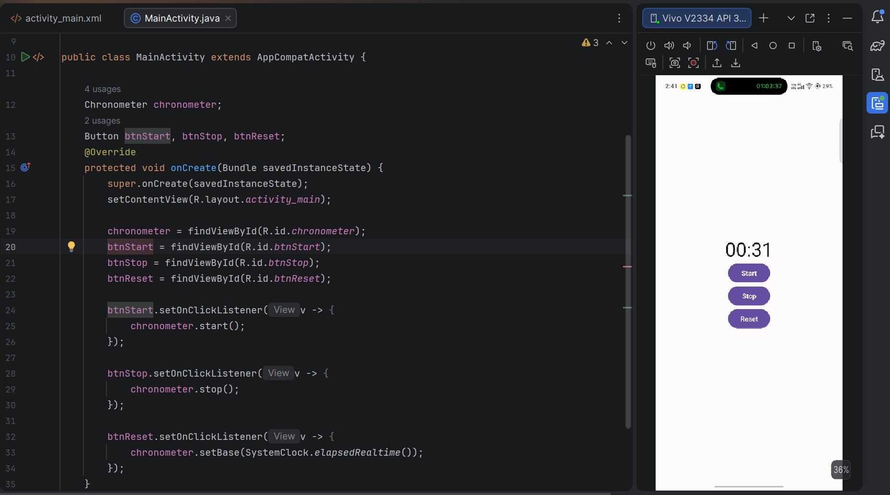
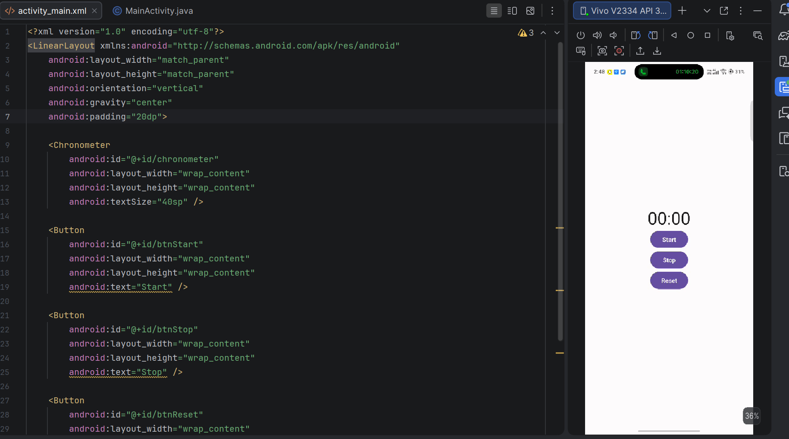

# ⏱️ Digital Clock Stopwatch

A simple Android Stopwatch application developed using **Java** in **Android Studio**. The app uses Android's built-in **Chronometer** widget to provide stopwatch functionality with Start, Stop, and Reset controls.

## 📱 Features

- ▶️ Start the stopwatch
- ⏸️ Stop/Pause the stopwatch
- 🔄 Reset the stopwatch to 00:00
- Clean and simple user interface
- Built using Java and XML

## 🛠️ Technologies Used

- Java
- Android Studio
- XML
- Android SDK
- Chronometer Widget

## 🚀 How It Works

### Start Button
Starts the stopwatch using:

```java
chronometer.start();
```

### Stop Button
Stops the stopwatch using:

```java
chronometer.stop();
```

### Reset Button
Resets the stopwatch to **00:00** using:

```java
chronometer.setBase(SystemClock.elapsedRealtime());
```

---

## 📸 Screenshots





## ▶️ Installation

1. Clone this repository

```bash
git clone https://github.com/kumaresh555/DigitalClockStopwatch.git
```

2. Open the project in **Android Studio**

3. Sync Gradle

4. Run the application on an Android Emulator or Physical Device.

## 📋 Requirements

- Android Studio
- Android SDK
- Java 8 or above
- Android 5.0 (API 21) or higher

## 💡 Future Improvements

- Lap Time Feature
- Dark Mode
- Millisecond Precision
- Material Design UI
- Save Stopwatch State after Screen Rotation

## 👨‍💻 Author

Kumaresh S

Intern ID: CITS4419

GitHub: https://github.com/kumaresh555

## 📄 License

This project is developed for learning and educational purposes.
